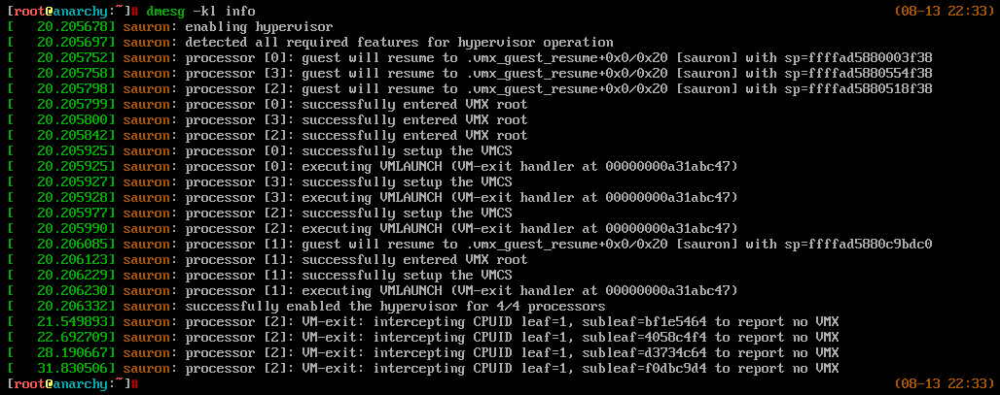

# Sauron



`sauron` is a type-2 Intel VT-x hypervisor for blue-pilling a booted 64-bit Linux system ~~and a bad LOTR reference~~. It utilises Intel's virtualisation extensions (VMX) to place itself above the kernel (ring -1) then intercepts operations/events from the guest.

`sauron` is **not** for practical applications, it is an educational project to learn about VMX; the kernel module is **unstable** which will crash your system.

## Features
* `CPUID` emulation and subversion

### Description
The kernel module initialises the logical processor state by modifying CR0 and CR4. Then the module allocates a VMCS, VMXON, and MSR bitmap prior to executing `VMXON`, `VMPTRLD`, and `VMCLEAR`. Once the VMX CPU structures are loaded, the VMCS is fully initialised with the current system state. Finally, the logical processor executes `VMLAUNCH` which enables the hypervisor (implicitly placing the kernel module above the kernel itself).

During execution, several events and instructions cause VM-exits which the hypervisor can trace and modify without the guest's knowledge. This allows the hypervisor to subvert the guest by modifying values indicating the presence of a hypervisor (e.g. `CR4.VMXE[bit 13]`, `CPUID.1:ECX.VMX[bit 5]`, etc.). The hypervisor is disabled by executing `CPUID` with a magic leaf and subleaf which is intercepted by the hypervisor.

### Built With
* [ia32-doc](https://github.com/wbenny/ia32-doc) which provides usable C definitions of numerous structures and constants defined in the Intel manuals.

## Getting Started

### Prerequisites

* 64-bit Intel processor with VT-x ([VMX](https://www.intel.com/content/www/us/en/support/articles/000005486/processors.html)) support.
```sh
$ grep "vmx" /proc/cpuinfo
```
* 64-bit Linux kernel 5.7.8 (or above).
```sh
$ uname -r
X.Y.Z-<distrubution>
```
* [Kernel module signing](https://wiki.archlinux.org/index.php/Signed_kernel_modules) is disabled.
```sh
$ grep "module.sig_enforce=1" /proc/cmdline
```

_`sauron` was tested and developed on 64-bit 5.7.12-arch1-1 on an i5-6500 under VMware_

### Installation

1. Clone the repository.
```sh
$ git clone https://github.com/birb007/sauron.git
```
2. Compile the kernel module.
```sh
$ make clean && make
```

## Usage
All the following commands must be ran as **root**. Firstly, the kernel module must be loaded.
```sh
$ insmod sauron.ko
```
Then the hypervisor can be disabled/enabled with the below commands.
```sh
$ echo 1 > /sys/kernel/sauron/enable # enable
$ echo 0 > /sys/kernel/sauron/enable # disable
```
Use `dmesg` to view output from the kernel module.
```sh
$ dmesg -k | grep sauron
```

## Troubleshooting
If an issue occurs, attempt to replicate it with a debug build to provide more context. To build a debug release, run the below command.
```sh
make debug
```
Then create an issue on GitHub with the output and any other relevant information (no guarantees it will be fixed).

### Issues
* KVM and VirtualBox do not properly implement `XSAVE` under nested VMX which causes `sauron` to immediately crash the host.
* Prolonged execution will result in a crash.
* Not all error cases are accounted for which can result in crashes or unexpected behaviour in untested environments.

## Future Development
* Implement EPT shadow hooks
* Implement tracing handlers for events causing a VM-exit.

## Acknowledgements
* [Gbhv](https://github.com/Gbps/gbhv) is a hypervisor for Windows which inspired significant aspects of the overall design.
* [KSM](https://github.com/asamy/ksm) is a hypervisor for Linux and Windows which provided a reference while troubleshooting.
* [SimpleVisor](https://github.com/ionescu007/SimpleVisor) provided inspiration for several aspects of the design.
* [Intel SDM 3C (Part 3, Chapter 23)](https://software.intel.com/content/www/us/en/develop/download/intel-64-and-ia-32-architectures-sdm-combined-volumes-3a-3b-3c-and-3d-system-programming-guide.html) is the authoritative resource on VMX.
* [Reverse Engineering Discord](https://discord.gg/PSfAu8N) answered all of my questions which was crucial during development.
